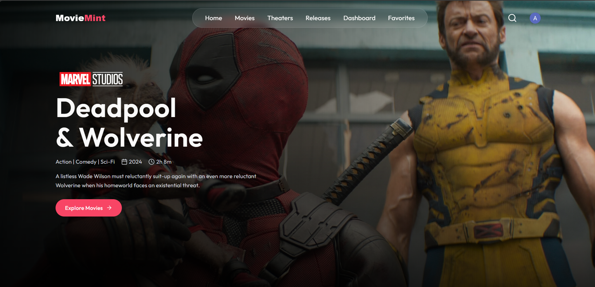
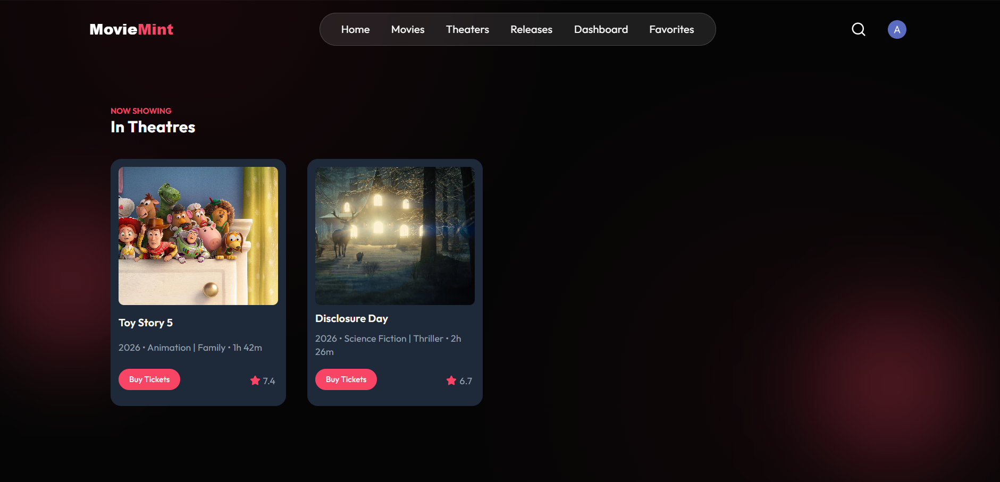
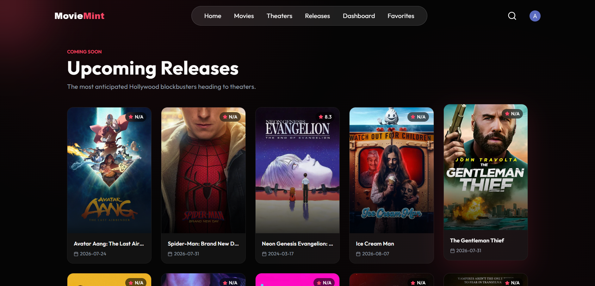
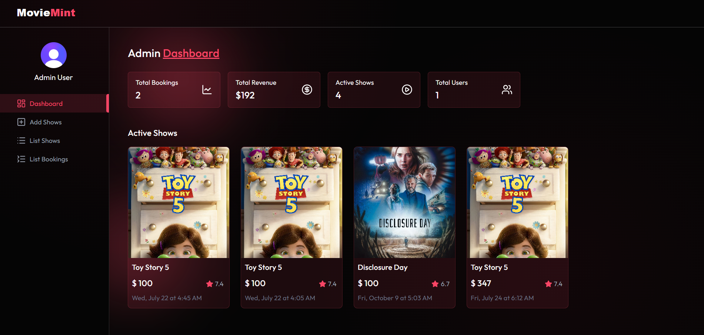

# 🎬 MovieMint

MovieMint is a modern, full-stack web application built with the MERN stack. It offers a comprehensive platform for managing and exploring movies, featuring secure user authentication, seamless payments, and a responsive, beautiful UI.

## ✨ Key Features

### 🎬 For Users
- **Browse & Discover:** Explore a vast library of movies, view detailed information, and discover upcoming releases.
- **Interactive Seat Selection:** Choose your preferred seats using a dynamic and visual theater seat layout.
- **Secure Ticket Booking:** Seamlessly book movie tickets with integrated [Stripe](https://stripe.com/) payments.
- **Personalized Experience:** Add movies to your favorites and manage all your past and upcoming bookings in one place.
- **Authentication:** Safe and secure login/registration powered by [Clerk](https://clerk.com/).

### 🛡️ For Administrators
- **Comprehensive Dashboard:** A dedicated, secure admin panel to oversee platform operations.
- **Movie & Show Management:** Easily add new movies, schedule showtimes, and manage theater details.

## 📁 Project Structure

This project follows a standard MERN stack structure, cleanly separating the frontend client from the backend server.

### `/client` (Frontend)
Built with React 19, Vite, and Tailwind CSS.
- `src/pages/`: Main application views including `Home`, `MovieDetails`, `SeatLayout`, `MyBookings`, and protected `admin/` routes.
- `src/components/`: Reusable UI components.
- `src/context/`: React context for global state management.
- `src/lib/`: Utility functions and helper classes.

### `/server` (Backend)
Built with Node.js, Express, and MongoDB.
- `models/`: Mongoose schemas defining the database structure (`User`, `Movie`, `Show`, `Booking`).
- `controllers/`: Business logic handling API requests for users, bookings, shows, and admin tasks.
- `routes/`: Express API route definitions mapping to specific controllers.
- `inngest/`: Background job configurations and handlers.
- `configs/` & `middleware/`: Database configurations and custom request middleware.

## 📸 Screenshots

### Home Page


### Movies


### New Releases


### Admin Dashboard


## 🛠️ Tech Stack

### Frontend (`/client`)
- **Framework:** React 19 + Vite
- **Styling:** Tailwind CSS v4
- **Routing:** React Router v7
- **Icons:** Lucide React
- **Media Player:** React Player
- **Authentication:** @clerk/clerk-react

### Backend (`/server`)
- **Runtime:** Node.js
- **Framework:** Express.js
- **Database:** MongoDB (Mongoose)
- **Authentication:** @clerk/express, Svix (Webhooks)
- **Payments:** Stripe
- **Emails:** Nodemailer
- **Background Jobs:** Inngest

## 🚀 Getting Started

Follow these instructions to set up the project locally.

### Prerequisites
- Node.js (v18 or higher)
- MongoDB instance (local or MongoDB Atlas)
- Accounts for Clerk, Stripe, and Inngest

### 1. Clone the repository
```bash
git clone <your-repository-url>
cd MovieMint
```

### 2. Install Dependencies

**For Backend:**
```bash
cd server
npm install
```

**For Frontend:**
```bash
cd ../client
npm install
```

### 3. Environment Variables
Create a `.env` file in both the `client` and `server` directories and add the necessary environment variables.

**`server/.env` example:**
```env
PORT=5000
MONGODB_URI=your_mongodb_connection_string
CLERK_SECRET_KEY=your_clerk_secret_key
STRIPE_SECRET_KEY=your_stripe_secret_key
```

**`client/.env` example:**
```env
VITE_CLERK_PUBLISHABLE_KEY=your_clerk_publishable_key
VITE_API_URL=http://localhost:5000
```

*(Note: Adjust the variables based on the actual requirements of the project).*

### 4. Run the Application

Start the backend server:
```bash
cd server
npm run dev
```

Start the frontend development server:
```bash
cd client
npm run dev
```

The application should now be running on `http://localhost:5173` and the server on `http://localhost:5000`.

## 🤝 Contributing

Contributions, issues, and feature requests are welcome!

## 📝 License

This project is licensed under the ISC License.
